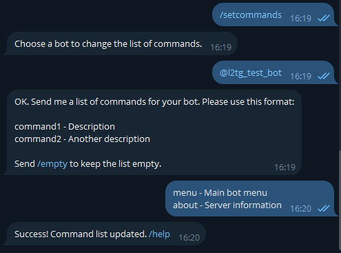

# Telegram Bot Creation

This guide shows how to create a Telegram bot and obtain the credentials required by the Hub.

## Create a bot with @BotFather:

1) In Telegram, search for `@BotFather` and start a chat.

2) Send `/newbot` and follow the prompts:

   - Choose a public display name (can be changed later).
   - Choose a unique username ending with `bot` (for example, `L2TestBot`).

3) BotFather will reply with your bot token. **Keep it secret**.


### Optional BotFather settings

- `/setdescription`, `/setabouttext`, `/setuserpic` — improve your bot profile.
- `/setcommands` — define command hints (the bot also presents menus; commands are optional).
- `/setprivacy` — leave privacy enabled for private chats; disable it only if you know why.

Bot supports four commands:

 - `/menu` - call main bot menu
 - `/start`, `/link` - call initial routine
 - `/about` - show custom server info

You can define them to be presented in the bot menu using `/setcommands`. 



## Configure the Hub with your bot data

- Open `config/hub.properties` on the Hub host and set:

```
# Bot username (without @)
tg.username=your_bot_name_bot

# Token from @BotFather (keep it secret!)
tg.token=1234567890:ABCDEF_your_token_here

# Comma‑separated list of admin chat IDs
tg.admin_chat_ids=1111111,2222222
```

### Find your Telegram chat ID(s)

- Easiest method: open `@userinfobot`, press Start, and it will show your chat ID.
- Alternatively, add your bot to a private chat/group, send a message, and use any Telegram ID finder tool/bot to read the chat ID.

## Security recommendations

- Never publish the token anywhere (including screenshots).
- Rotate the token in @BotFather with `/revoke` if it ever leaks; then update `tg.token` and restart the Hub.
- Limit who can administer your bot using `tg.admin_chat_ids`.

## Next steps

- Return to the [Installation](installation.md) and [Configuration](configuration.md) chapters, finish editing `hub.properties`, and start the Hub.
- Once the Hub is running, open Telegram and press Start on your bot to begin using it.