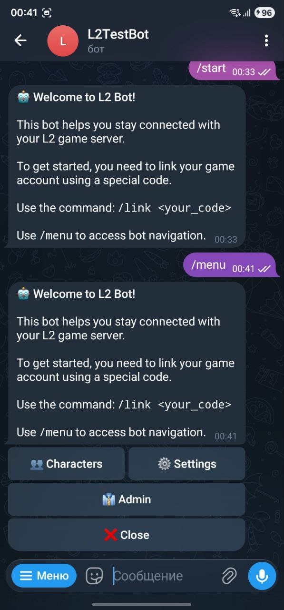
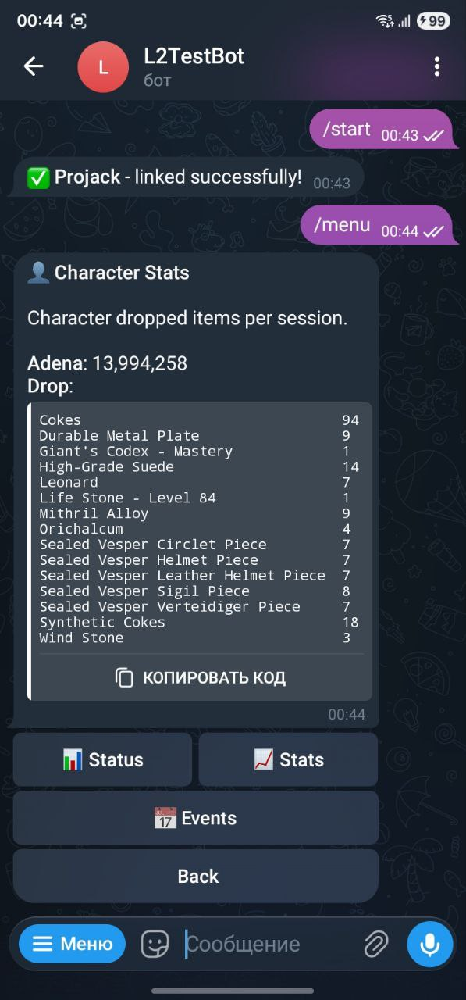

### Server QR link
{ width="300" }

Agent allows generation of QR code for a server link with all necessary parameters to autolink character to telegram user.
Players can scan QR code with their mobile phones to link their character to telegram user.

### Start bot and success link
{ width="300" } { width="300" }

You can start bot by sending `/start` command to your bot. After successful linking character to telegram user you can use `/menu` command to see bot's menu.
One user can link multiple characters to one telegram user.

### Selected character status and drop
{ width="300" } { width="300" }

You can see selected character status and drop items by choosing a character from the bot's menu.

### Events setup and example
{ width="300" } { width="300" }

Flexible events setup allows users to set up bot's notifications on specific events.

### Server status and server admin
{ width="300" }

Admin panel allows you to see server status and manage bot's settings. Unlink/Link character from/to telegram user.